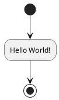

# 一切的开始：Hello World！
Hello World！程序作为许多程序员的起始，它是如此经典，因此我们使用它来作为一切的开始。 

对于几乎之前提到的所有语言，我们总有办法使其显示一个Hello World！同时该程序也是检验我们是否真正完成了相关环境的配置。

## 编程语言
### C

>[!tip|label:说明]

C语言是贝尔实验室的丹尼斯·里奇（Dennis Ritch）和肯·汤普逊（Ken Thompson）在开发UNIX操作系统时，基于B语言设计的。C语言设计的初衷是将其作为程序员使用的一种编程语言。经过将近50年的发展，C语言已经成为最重要、最流行的编程语言之一。

C语言执行效率高，它是最接近计算机底层的高级语言，具有许多突出的优点：

* 设计特性，融合了计算机科学理论和实践的控制特性，让用户能轻松地完成自顶向下的规划、结构化编程和模块化设计；
* 执行高效，在各高级语言中，C是执行最快的；
* 可移植性，C的可移植性很高，在一种系统中编写的C语言几乎不用修改就可以运行在其它系统里；
* C语言强大且灵活，如UNIX操作系统就是用C写的，windows的内核大部分也是用C语言写的，Android系统也是用C开发的等等；
* 面向程序员，C语言是为了满足程序员而设计的，可以利用C访问硬件、操作内存中的位，充分发挥硬件性能。

>[!note|label:语法]

略

>[!attention|label:示例]

```
#include<stdio.h>

int main()
{
	printf("Hello World!\n");
	return 0;
}
```

>[!warning|label:其他]

>[!tip|style:callout|label:执行方法]

使用IDE进行调试的方法略去不谈，在终端中编译生成相关文件，并执行的方法如下：

```terminal
gcc hello_world.c -o hello_world
```
-o 后名称的指定了编译生成文件的名称。

接下来只需要在终端输入：
```terminal
hello_world
```
即可输出正确结果。

>[!note|style:callout|label:小技巧]

如果不清楚是否成功编译，或者遇到其他问题，可以使用如下命令
```terminal
ls
```
该命令用于显示指定工作目录下之内容（列出目前工作目录所含的文件及子目录)。

### C++

>[!tip|label:说明]

20世纪70年代中期，Bjarne Stroustrup在剑桥大学计算机中心工作。他使用过Simula和ALGOL，接触过C。他对Simula的类体系感受颇深，对ALGOL的结构也很有研究，深知运行效率的意义。既要编程简单、正确可靠，又要运行高效、可移植，是Bjarne Stroustrup的初衷。以C为背景，以Simula思想为基础，正好符合他的设想。1979年，Bjame Sgoustrup到了Bell实验室，开始从事将C改良为带类的C（C with classes）的工作。1983年该语言被正式命名为C++。

C++从最初的C with class，经历了从C++98、C++ 03、C++ 11、C++ 14再到C++17多次标准化改造，功能得到了极大的丰富，已经演变为一门集面向过程、面向对象、函数式、泛型和元编程等多种编程范式的复杂编程语言。

C++的优点：
* 可扩展性强
* 高效 简洁 快速
* 可移植性
* 面向对象的特性
* 强大而灵活的表达能力和不输于C的效率
* 支持硬件开发
* 程序模块间的关系更为简单，程序模块的 独立性、数据的安全性就有了良好的保障
* 通过继承与多态性，可以大大提高程序的 可重用性，使得软件的开发和维护都更为方便

>[!note|label:语法]

略

>[!attention|label:示例]

```
#include <iostream>
using namespace std;
int main()
{
    cout << "Hello, World!" << endl;
    return 0;
}
```

>[!warning|label:其他]

>[!tip|style:callout|label:执行方法]

在终端输入
```terminal
g++ hello_world.cpp -o hello_world
```
-o 后名称的指定了编译生成文件的名称。

接下来只需要在终端输入：
```terminal
hello_world
```
即可输出正确结果

### C#

>[!tip|label:说明]

C#是微软公司在2000年6月发布的一种新的编程语言，主要由安德斯·海尔斯伯格（Anders Hejlsberg）主持开发，它是第一个面向组件的编程语言，其源码会编译成msil再运行。它借鉴了Delphi的一个特点，与COM(组件对象模型)是直接集成的，并且新增了许多功能及语法，而且它是微软公司.NET windows网络框架的主角。

C# 语言具备如下 4 个特点：
* 简单、安全在 C++ 和 C 语言中程序员最头疼的问题就是指针问题，在 C# 语言中已经不再使用指针，而且不允许直接读取内存等不安全的操作。
它比 C、C++、Java 提供了更多的数据类型，并且每个数据类型都是固定大小的。
此外还提供了命名空间来管理 C# 文件，命名空间 相当于一个文件夹，在创建程序时，允许在一个命名空间中创建一个或多个类，方便调用和重用。
* 与其他面向对象语言一样，C# 语言也具有面向对象语言的基本特征，即封装、继承、 多态。
  * 封装：就是将代码看作一个整体，例如使用类、方法、接口等。在使用定义好的类、 方法、接口等对象时不必考虑其细节，只需要知道其对象名以及所需要的参数即可，也是一种提升代码安全性的方法。
  * 继承：是一种体现代码重用性的特性，减少代码的冗余，但在 C# 语言中仅支持单继承。
  * 多态：不仅体现了代码的重用性，也体现了代码的灵活性，它主要通过继承和实现接口的方式，让类或接口中的成员表现出不同的作用。
* 支持跨平台最早的 C# 语言仅能在 Windows 平台上开发并使用，目前最新的 C# 6.0 版本已经能在多个操作系统上使用，例如在 Mac、Linux 等。此外，还能将其应用到手机、PDA 等设备上。
* 开发多种类型的程序使用 C# 语言不仅能开发在控制台下运行的应用程序，也能开发 Windows 窗体应用程序、网站、手机应用等多种应用程序，并且其提供的 Visual Studio 2015 开发工具中也支持多种类型的程序，让开发人员能快速地构建 C# 应用程序。

>[!note|label:语法]

略

>[!attention|label:示例]

```
using System;
namespace HelloWorldApplication
{
    /* 类名为 HelloWorld */
    class HelloWorld
    {
        /* main函数 */
        static void Main(string[] args)
        {
            /* 我的第一个 C# 程序 */
            Console.WriteLine("Hello World!");
            Console.ReadKey();
        }
    }
}
```

>[!warning|label:其他]

>[!tip|style:callout|label:执行方法]

一般而言C#在IDE中执行，如果需要在终端运行，可以输入如下命令
（由于C#属于微软开发的语言，因此以下命令仅在windows环境下进行过测试）：
```terminal
csc /out:hello_world.exe hello_world.cs
```
/out:后指定了生成文件的路径和文件名。

接下来只需要在终端输入：
```terminal
hello_world.exe
```
即可输出正确结果

### Java

>[!tip|label:说明]

Java 是由 Sun Microsystems 公司于 1995 年 5 月推出的 Java 面向对象程序设计语言和 Java 平台的总称。由 James Gosling和同事们共同研发，并在 1995 年正式推出。
后来 Sun 公司被 Oracle （甲骨文）公司收购，Java 也随之成为 Oracle 公司的产品。

Java主要特性
* Java 语言是简单的
* Java 语言是面向对象的
* Java语言是分布式的
* Java 语言是健壮的
* Java语言是安全的
* Java 语言是体系结构中立的
* Java 语言是可移植的
* Java 语言是解释型的
* Java 是高性能的
* Java 语言是多线程的
* Java 语言是动态的

>[!note|label:语法]

略

>[!attention|label:示例]

```
public class hello_world {
        public static void main(String[] args) {
            System.out.println("Hello World");
        }
    }
```

>[!warning|label:其他]

>[!tip|style:callout|label:执行方法]

如果要在终端运行程序，可以输入
```terminal
javac hello_world.java
```

这会生成hello_world.class文件

接下来只需要在终端输入：
```terminal
java hello_world
```
即可输出正确结果

### go

>[!tip|label:说明]

Go 语言起源 2007 年，并于 2009 年正式对外发布。它从 2009 年 9 月 21 日开始作为谷歌公司 20% 兼职项目，即相关员工利用 20% 的空余时间来参与 Go 语言的研发工作。该项目的三位领导者均是著名的 IT 工程师：Robert Griesemer，参与开发 Java HotSpot 虚拟机；Rob Pike，Go 语言项目总负责人，贝尔实验室 Unix 团队成员，参与的项目包括 Plan 9，Inferno 操作系统和 Limbo 编程语言；Ken Thompson，贝尔实验室 Unix 团队成员，C 语言、Unix 和 Plan 9 的创始人之一，与 Rob Pike 共同开发了 UTF-8 字符集规范。自 2008 年 1 月起，Ken Thompson 就开始研发一款以 C 语言为目标结果的编译器来拓展 Go 语言的设计思想。

Go语言的特性。
* 语法简单
* 并发模型
* 内存分配
* 垃圾回收
* 标准库
* 工具链

>[!note|label:语法]

略

>[!attention|label:示例]

```
package main

import "fmt"

func main() {
    fmt.Println("Hello World!")
}
```

>[!warning|label:其他]

>[!tip|style:callout|label:执行方法]

在终端输入：
```terminal
go run hello_world.go
```

即可成功执行

## 脚本语言
### Python

>[!tip|label:说明]

Python的创始人为Guido van Rossum。1989年圣诞节期间，在阿姆斯特丹，Guido为了打发圣诞节的无趣，决心开发一个新的脚本解释程序，作为ABC 语言的一种继承。之所以选中Python（大蟒蛇的意思）作为该编程语言的名字，是取自英国20世纪70年代首播的电视喜剧《蒙提.派森干的飞行马戏团》（Monty Python’s Flying Circus）。

Python 本身也是由诸多其他语言发展而来的,这包括 ABC、Modula-3、C、C++、Algol-68、SmallTalk、Unix shell 和其他的脚本语言等等。像 Perl 语言一样，Python 源代码同样遵循 GPL(GNU General Public License)协议。现在 Python 是由一个核心开发团队在维护，Guido van Rossum 仍然占据着至关重要的作用，指导其进展。

Python优点：
* 易于学习 - Python几乎没有关键字，结构简单，语法清晰。这允许学生快速学习语言。
* 易于阅读 - Python代码更清晰，更明显。
* 易于维护 - Python的源代码非常易于维护。
* 广泛的标准库 - Python的大部分库在UNIX，Windows和Macintosh上非常便携且跨平台兼容。
* 交互模式 - Python支持交互模式，允许交互式测试和调试代码片段。
* 便携式 - Python可以在各种硬件平台上运行，并且在所有平台上都具有相同的界面。
* 可扩展 - 您可以将低级模块添加到Python解释器。这些模块使程序员能够更高效地添加或定制他们的工具。
* 数据库 - Python为所有主要商业数据库提供接口。
* GUI编程 - Python支持GUI应用程序，可以创建和移植到许多系统调用，库和Windows系统，如Windows MFC，Macintosh和Unix的X Window系统。
* 可扩展 - 与shell脚本相比，Python为大型程序提供了更好的结构和支持。

>[!note|label:语法]

略

>[!attention|label:示例]

```
print("Hello, World!")
```

>[!warning|label:其他]

>[!tip|style:callout|lable:执行]

在终端输入：
```terminal
python hello_world.py
```
即可直接输出结果

### JavaScript

>[!tip|label:说明]

在 1995 年 Netscape 一位名为 Brendan Eich 的工程师创造了 JavaScript，随后在 1996 年初，JavaScript 首先被应用于 Netscape 2 浏览器上。最初的 JavaScript 名为 LiveScript，但是因为一个糟糕的营销策略而被重新命名，该策略企图利用 Sun Microsystem 的 Java 语言的流行性，将它的名字从最初的 LiveScript 更改为 JavaScript——尽管两者之间并没有什么共同点。这便是之后混淆产生的根源。

几个月后，Microsoft 随 IE 3 发布推出了一个与之基本兼容的语言 JScript。又过了几个月，Netscape 将 JavaScript 提交至 Ecma International（一个欧洲标准化组织），ECMAScript 标准第一版便在 1997 年诞生了，随后在 1999 年以 ECMAScript 第三版的形式进行了更新，从那之后这个标准没有发生过大的改动。由于委员会在语言特性的讨论上发生分歧，ECMAScript 第四版尚未推出便被废除，但随后于 2009 年 12 月发布的 ECMAScript 第五版引入了第四版草案加入的许多特性。第六版标准已经于 2015 年 6 月发布。

使用JavaScript的几个好处包括：

* 您不需要编译器，因为web浏览器使用HTML解释它；
* 它比其他编程语言更容易学习；
* 错误更容易发现，因此更容易纠正；
* 它可以分配给特定的网页元素或特定的事件，如单击或鼠标悬停；
* JS可以跨多个浏览器、平台等工作；
* 可以使用JavaScript验证输入并减少手动数据检查的需要；
* 使网站更具互动性，吸引访问者的注意力；
* 它比其他编程语言更快、更轻量级；

>[!note|label:语法]

略

>[!attention|label:示例]

```
console.log('Hello World!');
```

>[!warning|label:其他]

>[!tip|style:callout|label:执行方法]

只需在终端输入：
```terminal
node hello_world.js
```
程序即可运行并输出结果

>[!note|style:callout|label:备注]

事实上，上述在终端运行JavaScript代码是不合理的。
上述执行方式是使用node在不借助浏览器的方式下执行代码。
`console.log('Hello World!')`表示的是想浏览器控制台打印信息，与实际运用存在一定的差异。

事实上，真正合理的方式应当是使用如下代码
```
document.write("<p>Hello World!</p>")
```

并在要使用该JavaScript的HTML文件中使用：
```
<script src="hello_world.js"><\script>
```
来显示输出

### php

>[!tip|label:说明]

PHP 是一种HTML 内嵌式的语言，PHP与微软的ASP颇有几分相似，都是一种在服务器端执行的嵌入HTML文档的脚本语言，语言的风格有类似于C语言，现在被很多的网站编程人员广泛的运用。PHP 独特的语法混合了C、Java、Perl 以及PHP 自创新的语法。它可以比CGI 或者Perl 更快速的执行动态网页。用PHP做出的动态页面与其他的编程语言相比，PHP是将程序嵌入到HTML文档中去执行，执行效率比完全生成HTML标记的CGI要高许多;与同样是嵌入HTML文档的脚本语言JavaScript相比，PHP在服务器端执行，成分利用了服务器的性能;PHP执行引擎还会将用户经常访问的PHP程序驻留在内存中，其他用户在一次访问这个程序时就不需要诚信编译程序了，只要直接执行内存中的代码就可以了，这也是PHP高效率的体现之一。PHP具有非常强大的功能，所有的CGI或者JavaScript的功能PHP都能实现，而且支持几乎所有流行的数据库以及操作系统。

Php的优点

* 开放源代码
源代码开源是PHP的一大优势，所有的PHP源代码都可以看到。
* 完全免费
PHP和其它同类项竞争对手相比，免费是它的一大法宝，而且是开源代码。
* 便捷性
PHP程序开发快，运行快，因为PHP可以被嵌入于HTML语言，它相对于其他语言。编辑简单，实用性强，更适合初学者。
* 跨平台能力强
由于PHP是运行在服务器端的脚本，可以运行在UNIX、LINUX、WINDOWS、Mac OS、Android等多个平台上。
* 执行效率高
PHP和其他编程语言相比，系统资源消耗相对较少。
* 图像处理
用PHP动态创建图像，PHP图像处理默认使用GD2。同时也可以配置为使用image magick进行图像处理。
* 面向对象
在PHP4，PHP5 中，面向对象处理方面有了很大的提高，PHP完全可以用来开发大型程序。

>[!note|label:语法]

略

>[!attention|label:示例]

```
<?php
echo "Hello World!";
?>
```

>[!warning|label:其他]

>[!tip|style:callout|label:执行方法]

只要在终端输入以下代码：
```terminal
php hello_world.php
```
程序即可执行


## 汇编语言
### LC-3

>[!tip|label:说明]

略

>[!note|label:语法]

略

>[!attention|label:示例]

```
.ORIG x3000 ;程序开始于x3000
        LEA R0,OUTPUT;将要输出的字符串的首地址存入R0
        PUTS;输出
OUTPUT .STRINGZ "Hello World!" ;要输出的字符串
HALT
.END
```

>[!warning|label:其他]

>[!tip|style:callout|label:执行方法]

需要使用相关的模拟器，未发现配置好环境即可直接在终端运行的方式。

### RISC-V

>[!tip|label:说明]

RISC- V 最早源自 2010 年夏天美国加州大学伯克利分校 Krste Asanović 教授 主持的一个关于开源计算机系统的研究项目。该项目得到了美国国防高级研究计 划局（Defense Advanced Research Projects Agency，DARPA）的资助，后来成为 RISC-V 的前身。

RISC-V 中的字母 V 表示第五代的意思，所以发音时应该发作“RISC-Five”， 表示它师承于伯克利分校之前开发的一系列 RISC 指令集。根据 RISC-V 的族 谱，RISC-V 之前四代指令集都产生于 20 世纪 80 年代。当然，RISC-V 在其形成 过程中，也从其他各种流行的指令集（MIPS、SPARC、ARM 等）中吸取了经验教训。

RISC-V 指令集对处理器设计的正面影响：
* 引入指令长度编码
* 指令集规模较小，指令格式规整
* 每条指令实现单个功能 与 CISC 指令集的设计思想截然相反，RISC-V 指令集中的每条指令只集中于 优化实现单个的功能，这种将复杂任务通过多个单功能的指令来实现的做法也一直 是 RISC 指令集的指导思想
* 内存访问只能通过 LOAD/STORE

>[!note|label:语法]

略

>[!attention|label:示例]

```
.data
    HelloWorld:.string "Hello World!"
.text
    la a0,HelloWorld
    li a7,4  #打印的系统调用号为4
    ecall

    li a7,10 #退出的系统调用号为10 
    ecall
```

>[!warning|label:其他]

>[!tip|style:callout|label:执行方法]

暂时未找到在终端运行的方法，直接在模拟器上运行。

### MIPS

>[!tip|label:说明]

略

>[!note|label:语法]

略

>[!attention|label:示例]

~~~
.data
hello_msg:  .asciiz "Hello World!\n"   # 存储Hello World消息

.text
.globl main

main:
    # 输出Hello World消息
    li $v0, 4             # 使用系统调用4，表示输出字符串
    la $a0, hello_msg     # 将hello_msg的地址加载到寄存器$a0
    syscall               # 执行系统调用

    # 退出程序
    li $v0, 10            # 使用系统调用10，表示退出程序
    syscall               # 执行系统调用
~~~

>[!warning|label:其他]

>[!tip|style:callout|label:执行方法]

暂时未找到在终端运行的方法，直接在模拟器上运行。

### loongarch

>[!tip|label:说明]

略

>[!note|label:语法]

略

>[!attention|label:示例]

```
.data

string: .asciz "Hello World!\r\n"

.text
.global main
main:

    li.w $a7, 64              # write syscall number
    li.w $a0, 1               # stdout file descriptor == 1
    la $a1, string            # string address
    li.w $a2, 15              # string len
    syscall 0x0               # syscall

    li.w $a7, 93              # exit syscall number
    li.w $a0, 0
    syscall 0x0               # syscall
```

>[!warning|label:其他]

>[!tip|style:callout|label:执行方式]

目前执行方式尚不明朗，正在寻找中。

## 结构化查询语言
### sql

>[!tip|label:说明]

SQL语言1974年由Boyce和Chamberlin提出，并首先在IBM公司研制的关系数据库系统SystemR上实现。

美国国家标准局(ANSI)开始着手制定SQL标准，并在1986年10月公布了最早的SQL标准，扩展的标准版本是1989年发表的SQL-89，之后还有1992年制定的版本SQL-92和1999年ISO发布的版本SQL-99。

SQL标准几经修改和完善，其功能更加强大，但目前很多数据库系统只支持SQL-99的部分特征，而大部分数据库系统都能支持1992年制定的SQL-92。

SQL语言的特点：
* 综合统一
可独立完成数据库生命周期中的全部活动，包括定义关系模式、录入数据以建立数据库、查询、更新、维护、数据库重构、数据库安全性控制等一系列操作要求。
* 高度非过程化
只需提出需求，也就是要"做什么"；无需考虑过程，无需考虑该 “怎么做”。SQL语句的操作过程会由系统自动完成。大大减轻了用户负担，提高了数据独立性。
* 面向集合的操作方式
查找的结果以及一次插入、删除、更新操作的对象都可以是元组的集合。
* 以同一种语法结构提供多种使用方式
SQL语言既是自含式语言，又是嵌入式语言。
  * 作为自含式语言，它能够独立地用于联机交互的使用方式；用户可以在终端键盘上直接键入SQL命令对数据库进行操作。
  * 作为嵌入式语言，SQL语句能够嵌入到高级语言程序中，供程序员设计程序时使用。
而在两种不同的使用方式下，SQL的语法结构基本上是一致的。这种以统一的语法结构提供两种不同的操作方式，为用户提供了极大的灵活性与方便性。
* 语言简洁，易学易用
SQL功能极强，但由于设计巧妙，语言十分简洁，完成数据定义、数据操纵、数据控制的核心功能只用了9个动词

>[!note|label:语法]

略

>[!attention|label:示例]
```
SELECT "Hello, world!";
```

>[!warning|label:其他]

>[!tip|style:callout|label:执行方法]

运行sql文件需要连接到数据库，在终端执行时需要执行如下语句（以MySQL为例）：
```terminal
mysql -uroot -p
```
并在执行后输入密码

打开之后，即可按照如下步骤执行：
```terminal
mysql>source hello_world.sql
```
其中`mysql>`是数据库显示的。

## 硬件设计语言
### Verilog

>[!tip|label:说明]

略

>[!note|label:语法]

略

>[!attention|label:示例]

~~~
module hello_world ;
 
initial begin
  $display ("Hello World!\n");
   #10  $finish;
end
 
endmodule
~~~

>[!warning|label:其他]

>[!tip|style:callout|label:执行方法]

暂未发现在终端运行的方法，在专用软件中运行即可。

## 标记语言

### markdown

>[!tip|label:说明]

Markdown是一种可以使用普通文本编辑器编写的标记语言，通过简单的标记语法，它可以使普通文本内容具有一定的格式。

使用 Markdown 的优点
* 专注你的文字内容而不是排版样式，安心写作。
* 轻松的导出 HTML、PDF 和本身的 .md 文件。
* 纯文本内容，兼容所有的文本编辑器与字处理软件。
* 随时修改你的文章版本，不必像字处理软件生成若干文件版本导致混乱。
* 可读、直观、学习成本低。

>[!note|label:语法]

略

>[!attention|label:示例]

```
Hello World!
```

>[!warning|label:其他]

>[!tip|label:执行方式]

markdown几乎不怎么需要特别说明执行方式，不过在使用markdown导出时，如果导出的PDF文档存在问题，可以尝试使用浏览器打开，浏览器渲染之后直接右键选择打印即可导出渲染完毕的PDF文档。

### Latex

>[!tip|label:说明]

LaTeX（LATEX，音译“拉泰赫”）是一种基于ΤΕΧ的排版系统，由美国计算机学家莱斯利·兰伯特（Leslie Lamport）在20世纪80年代初期开发，利用这种格式，即使使用者没有排版和程序设计的知识也可以充分发挥由TeX所提供的强大功能，能在几天，甚至几小时内生成很多具有书籍质量的印刷品。对于生成复杂表格和数学公式，这一点表现得尤为突出。因此它非常适用于生成高印刷质量的科技和数学类文档。这个系统同样适用于生成从简单的信件到完整书籍的所有其他种类的文档。

LaTeX的优点包括1234:
* 产生的输出质量远远优于Word或任何其他文字处理软件，尤其是对于那些数学内容、图表等密度较高的论文来说。
* 具有更好的字距、连字符和调整程序，使用了一种创新的方法，以一种复杂和精细的方式对文本进行布局。
* 具有方便而强大的数学公式排版能力，无出其右者。
* 绝大多数时候，用户只需专注于一些组织文档结构的基础命令，无需（或很少）操心文档的版面设计。
* 很容易生成复杂的专业排版元素，如脚注、交叉引用、参考文献、目录等。
* 强大的可扩展性，世界各地的人开发了数以千计的 LATEX 宏包用于补充和扩展 LATEX 的功能。
* LATEX 和 TEX 及相关软件是跨平台、免费、开源的。无论用户使用的是 Windows，macOS（OS X），GNU/Linux 还是 FreeBSD 等操作系统，都能轻松获得和使用这一强大的排版工具，并且获得稳定的输出。

>[!note|label:语法]

略

>[!attention|label:示例]

```
\documentclass{article}
\begin{document}
Hello World!
\end{document}
```

>[!warning|label:其他]

>[!tip|style:callout|label:运行方法]

略

### HTML

>[!tip|label:说明]

HTML(Hyper Text Markup Language)中文译为“超文本标记语言”，主要是通过HTML标记对网页中的文本、图片、声音等内容进行描述。

HTML不是一种编程语言，而是一种标记语言，它提供了许多标记，如段落标记、标题标记、超链接标记、图片标记等，网页中需要定义什么内容，就用相应的HTML标记描述即可。

HTML之所以称为超文本标记语言，不仅是因为他通过标记描述网页内容，同时也由于文本中包含了所谓的“超级链接”点。通过超链接将网站与网页以及各种网页元素链接起来，构成了丰富多彩的Web页面。

HTML的优点包括:
* 增强用户体验。比如在html语言中，“title、alt”可以用来解释相关名词或者解释图片。
有利于其他平台或者设备进行解析。比如盲人阅读器、手机阅读等，使用html能够更方便解析。
* 有利于SEO优化。html包含了一系列的标签，通过这些标签能够将文档的格式统一，而更有利于爬虫获取标签的权重。
* 减少维护成本。使用html进行格式统一后，团队都遵循统一的标准，更有利于团队的维护，从而使得维护成本减少。
* 跨平台。HTML不依赖任何特定的操作系统或软件，可以在任何计算机上运行。
* 简单易学。超级文本标记语言版本升级采用超集方式，从而更加灵活方便。
* 可扩展。允许网页设计者自定义标签和属性。
* 通用性。HTML是网络的通用语言，一种简单、通用的全置标记语言。它允许网页制作人建立文本与图片相结合的复杂页面，这些页面可以被网上任何其他人浏览到，无论使用的是什么类型的电脑或浏览器。

>[!note|label:语法]

略

>[!attention|label:示例]

```
<!DOCTYPE html>

<body>
    <p>
        Hello World！
    </p>
</body>
```

>[!warning|label:其他]

>[!tip|label:执行方法]

略

### PlantUML

>[!tip|label:说明]

PlantUML 是一个开源工具，允许用户使用纯文本描述来创建 UML (统一建模语言) 图形。由于它使用文本来描述图形，因此可以很容易地将这些描述与源代码一起存储在版本控制系统中。然后，PlantUML 负责将这些描述转换为图形。

PlantUML是一个开源项目，支持快速绘制多种图形，最棒的是可以用写代码的模式来“画”UML图。它的优点包括：
* 语法简洁明了，易于学习和使用；
* 高度可扩展性，支持插件和自定义样式和图标；
* 与现有工具集成，如Visual Studio Code、IntelliJ IDEA等；
* 跨平台，可在Windows、Mac OS X和Linux等操作系统上运行；
* 容易在Git上进行版本跟踪，差异对比等版本管理工作；
* 像MarkDown一样，用纯文本编写，自动生成友好图形；
* 可以画出更专业的UML图，而且文本格式也便于保存。

>[!note|label:语法]

略

>[!attention|label:示例]

```
@startuml
(*) --> "Hello World!"
--> (*)
@enduml
```

>[!warning|label:其他]

>[!tip|style:callout|label:执行方法]

略

>[!note|style:callout|label:显示效果]



## 其他语言

### xml

>[!tip|label:说明]

XML（Extensible Markup Language）是一种类似于 HTML，但是没有使用预定义标记的语言。因此，可以根据自己的设计需求定义专属的标记。这是一种强大将数据存储在一个可以存储、搜索和共享的格式中的方法。最重要的是，因为 XML 的基本格式是标准化的，如果你在本地或互联网上跨系统或平台共享或传输 XML，由于标准化的 XML 语法，接收者仍然可以解析数据。

XML的优点包括：
* 格式统一，符合标准
* 容易与其他系统进行远程交互，数据共享比较方便
* 灵活的数据呈现方式
* 可移植性
* 简化数据共享
* 可扩展
* 支持Unicode
* 自文档格式
* 用途广泛
* DTD和Schema验证

>[!note|label:语法]

略

>[!attention|label:示例]

```
<?xml version="1.0" encoding="UTF-8" ?>
<?xml-stylesheet type="text/css" href="css/salutation.css"?>
<root>
    <abc>Hello world</abc>
</root>

```

>[!warning|label:其他]

>[!tip|style:callout|label:执行方法]

略

### JSON

>[!tip|label:说明]

JSON（JavaScript Object Notation, JS对象简谱）是一种轻量级的数据交换格式。它基于 ECMAScript（European Computer Manufacturers Association, 欧洲计算机协会制定的js规范）的一个子集，采用完全独立于编程语言的文本格式来存储和表示数据。简洁和清晰的层次结构使得 JSON 成为理想的数据交换语言。 易于人阅读和编写，同时也易于机器解析和生成，并有效地提升网络传输效率。

JSON的优点:
* 数据格式比较简单, 易于读写, 格式都是压缩的, 占用带宽小
* 易于解析这种语言, 客户端JavaScript可以简单的通过eval_r()进行JSON数据的读取
* 支持多种语言, 包括ActionScript, C, C#, ColdFusion, Java, JavaScript, Perl, PHP, Python, Ruby等语言服务器端语言, 便于服务器端的解析
* 在PHP世界, 已经有PHP-JSON和JSON-PHP出现了, 便于PHP序列化后的程序直接调用. PHP服务器端的对象、数组等能够直接生JSON格式, 便于客户端的访问提取.
* 因为JSON格式能够直接为服务器端代码使用, 大大简化了服务器端和客户端的代码开发量, 但是完成的任务不变, 且易于维护

>[!note|label:语法]

略

>[!attention|label:示例]

```
{
    "message": "Hello World!"
}
```

>[!warning|label:其他]

>[!tip|style:callout|label:运行方式]

显然上述定义不会有任何输出，需要在其他文件中引用。

一种可以参考的运行方式如下：

```
import json
with open('hello_world.json', 'r') as file:
    data = json.load(file)
print(data['message'])
```

### css

>[!tip|label:说明]

层叠样式表（Cascading Style Sheets，缩写为 CSS）是一种样式表语言，用来描述 HTML 或 XML（包括如 SVG、MathML 或 XHTML 之类的 XML 分支语言）文档的呈现方式。CSS 描述了在屏幕、纸质、音频等其他媒体上的元素应该如何被渲染的问题。

CSS 是开放 Web 的核心语言之一，并根据 W3C 规范在 Web 浏览器中进行了标准化。以前，CSS 规范的各个部分的开发是同步进行的，这种方式允许对最新推荐的 CSS 版本进行控制。你可能已经听说过 CSS1、CSS2.1 甚至 CSS3。但是以后将不会再有 CSS3 或者 CSS4；相反，现在的一切都是没有版本号的 CSS。

CSS的优点：
* ​节省时间​：可以编写一次CSS，然后在多个HTML页面中通过外部引入多次​重复使用​
* ​页面加载速度更快​​：通过使用CSS，就不需要每次都编写HTML标记属性，只需要编写一个标记的CSS规则，并将其应用于该标记的所有实例，因此代码大大减少也就意味着下载时间短。
* ​易于维护​​：如果要进行全局更改，则只需​更改样式​，所有网页中的所有元素都将会自动更新。
* ​多设备兼容性​：样式表允许针对多种不同类型的设备进行优化内容。
* 浏览器在样式表中​从上到下​读取样式定义。这也说明我们在样式表中定义的样式将覆盖样式表中先前定义的任何先前样式，不过我们可以在后面的元素中重新定义则不会被覆盖。

>[!note|label:语法]

略

>[!attention|label:示例]

```
hw
{
    background-color: black;
    color:white;
}
```

>[!warning|label:其他]

>[!tip|style:callout|label:执行方法]

由于css用于控制样式，因此上述并不会直接输出，需要被引用。

事实上使用前文的xml可以引用该部分，显示效果为黑底白字。