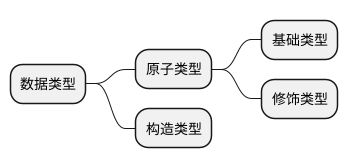
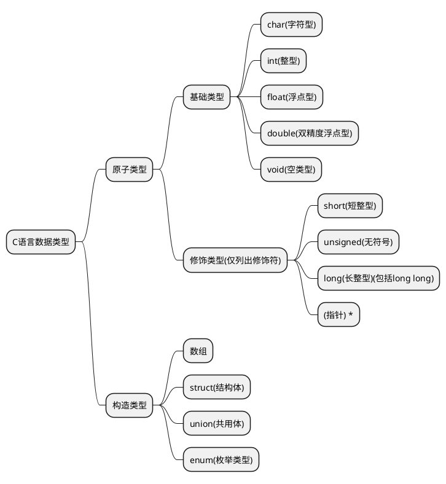

## 数据类型
>[!tip|label:说明]

对于任何语言都离不开对于数据的表示，了解不同语言的数据以及其数据类型非常重要。
而在诸多不同的语言中，数据类型表示十分繁杂，在这里，笔者大胆的将不可划分的数据类型称为原子类型，相应的，可划分的称为构造类型。

此外，在有些语言中，原子类型也可以被进一步划分，即基础类型，以及在基础类型上增加一些修饰限定词所形成的修饰类型，将这些修饰限定词称为修饰符。

因此，有上述解释，可以简单的对数据类型做如下划分：

### C

>[!tip|label:说明]

C语言的数据类型大致可以分为以下几种：



>[!note|label:语法]

#### 原子类型-基础类型

对于原子类型的基础类型
定义方式一律为：
```
基础类型名 变量名(=初始化变量值);
```

void类型较为特殊，一般用于没有函数值返回的函数
因此定义方式一般为：
```
void 函数名称(参数){函数内容}
```

#### 原子类型-修饰类型

short和long（包括long long）只能用于int前，形成不同长度的整型。

unsigned表示的是无符号数，只能用在int(可在short和long前以及char前。

*用于表示指针，\*放在变量后，表示该类型的指针。

#### 构造类型

数组较为特殊，声明方式如下：
```
数组类型 数组名[数组长度](={初始化数组值});//当初始化数组值只有一个零时表示将数组初始化为零
```

对于struct和union，声明方式为：
```
构造类型 构造类型变量名
{
    成员变量类型1 成员变量名1;
    成员变量类型2 成员变量名2;
    ……
    成员变量类型n 成员变量名n;
};
```

对于枚举类型，声明方式为：
```
enum　枚举名　
{
    枚举元素1,
    枚举元素2,
    ……,
    枚举元素n
};
```

>[!attention|label:示例]

#### 原子类型-基础类型

```
char NameOfChar = '\0';//初始化一个char型变量，变量名为NameOfChar,初始化值为'\0'
int NameOfInt = 0;
float NameOfFloat = 0;
double NameOfDouble = 0; 
void add(int a,int b)
{
    int c;
    c=a+b;
}
```

#### 原子类型-修饰类型

```
short int NameOfShort = 0;//可写为short省略int
long int NameOfLong = 0;
long long int NameOfLLong = 0;//可省略int
unsigned int NameOfUint = 0;//可省略int
unsigned char = '\0'; //不可省略char
unsigned short = 0;
int *NameOfP = NULL; //NULL是个宏定义，表示初始化为空指针 
```

#### 构造类型

```
int NameOfArray[10] = {0}//初始化一个整型数组，长度为10，初始化值为0

struct NameOfStruct
{
    int name1;
    char name2;
    float name3;
}; //声明一个结构体
typedef struct NameOfStruct NOS; //使用NOS代替structNameOfStruct方便后续书写代码
NOS nameofstruct = {0,'\0',0}; //定义一个结构体变量

union NmaeOfUnion
{
    int a;
    double pi;
    char str[20];
};//声明一个共用体

union NameOfUnion nameofunion;//定义一个共用体变量

enum NameOfEnum
{
      name1=1, name2, name3, name3, name4, name5, name6
};//声明一个枚举类型

enum NameOfEnum nameofenum;//定义一个枚举类型变量

```
