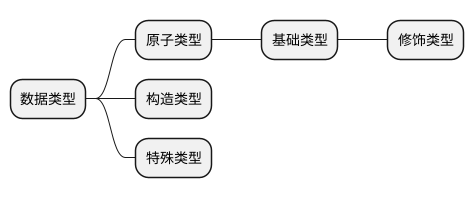

# 数据类型
>[!tip|label:说明]

对于任何语言都离不开对于数据的表示，了解不同语言的数据以及其数据类型非常重要。
而在诸多不同的语言中，数据类型表示十分繁杂，在这里，笔者大胆的将不可划分的数据类型称为原子类型，相应的，可划分的称为构造类型。

此外，在有些语言中，原子类型也可以被进一步划分，即基础类型，以及在基础类型上增加一些修饰限定词所形成的修饰类型，将这些修饰限定词称为修饰符。

特别的，在某些语言中，很难对该类型做一个严格而准确的定义，因此在这里增加了特殊类型一栏。

因此，有上述解释，可以简单的对数据类型做如下划分（这里将修饰类型放在基础类型下，用于表示衍生关系）：

## 编程语言
### [- C数据类型](/SubDivPart/数据类型/C数据类型.md)

