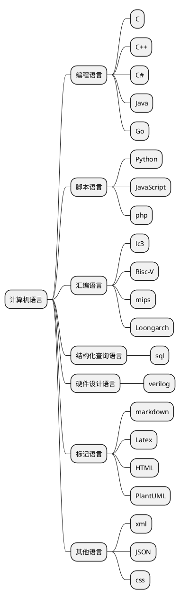

# 语言的分类
>[!tip|label:说明]

对于计算机而言，常见的语言可分为以下几种：

编程语言：是用来定义计算机程序的形式语言。它是一种被标准化的交流技巧，用来向计算机发出指令。一种计算机语言让程序员能够准确地定义
计算机所需要使用的数据，并精确地定义在不同情况下所应当采取的行动。

脚本语言：是为了缩短编程语言的“编写、编译、链接、运行”等过程而创建的计算机编程语言。是一种用来解释某些东西的语言，又被称为扩建的语言，或者动态语言，用来控制软件应用程序，脚本通常以文本保存，只在被调用时进行解释或编译。

汇编语言：是低级语言中的一种。它直接表达了CPU指令集的含义。与高级语言不同，汇编语言使用机器语言指令来表示操作。汇编语言程序需要通过汇编器的翻译、链接等步骤最终生成目标文件或可执行程序。汇编语言程序具有高效、灵活、可控等优点。

标记语言：是一种将文本以及文本相关的其他信息结合起来，展现出关于文档结构和数据处理细节的电脑文字编码。与文本相关的其他信息（包括文本的结构和表示信息等）与原来的文本结合在一起，但是使用标记进行标识。标记语言不仅仅是一种语言，就像许多语言一样，它需要一个运行时环境，使其有用。

特殊的，verilog应当属于编程语言，但较为特殊，因此单独划分为硬件设计语言。
而sql则更为特殊，划分为结构化查询语言。

但除了上述语言，有些语言，如CSS，JSON等我们很难确实的判断其究竟是什么语言，在这里统一划分为其他语言。另外xml作为标记语言，主要用途是数据传输，在取舍之后，决定将xml划分为其他语言，这里或许有严谨性上的缺失，但考虑到JSON语言，决定将二者划分到一起，以便对比。

则本速查手册主要包含的语言目前如下；

