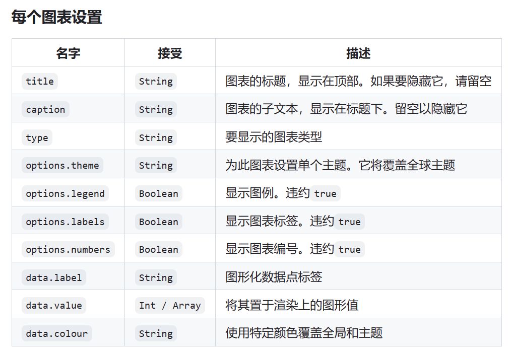

# 长风暮云

> 使用开源项目Docsify来建造一份属于自己的个人笔记网站

### 导航目录

Docsify页面拥有导航页，详见左侧

### 搜索

请在导航目录最上侧寻找，支持搜索文件内容

### 语法高亮
页面支持语法高亮
包括以下四种格式

> [!note]
> 这里是蓝色的语法高亮模块

> [!tip]
> 这里是绿色的语法高亮模块

> [!warning]
> 这里是黄色的语法高亮模块

> [!attention]
> 这里是红色的语法高亮模块

### latex支持
latex语法略

### plantUML语法支持
支持插入plantUML。
语法略。

### 支持页面竖行分页布局
测试成功，但请在横版电脑上使用，竖版时显示不会变化

语法为：
~~~
<!-- slide:break -->
or
<!-- slide:break-# -->
or
<!-- slide:break-30 -->//表示左偏30
~~~

### 支持绘制数据统计图
> [!tip]
> 

暂时没有使用需求，后台已经关闭

### 支持阅读进度条

### 支持终端代码块颜色改变
如：
```terminal
hellow world
```

此外还有：
```terminal
|warning|npm run build
|info|npm run start
|error|npm run start
|success|npm run start
```

### 支持markmap插入

```markmap
# test1

## test2

 - 123

## hello world

 - 345
```
