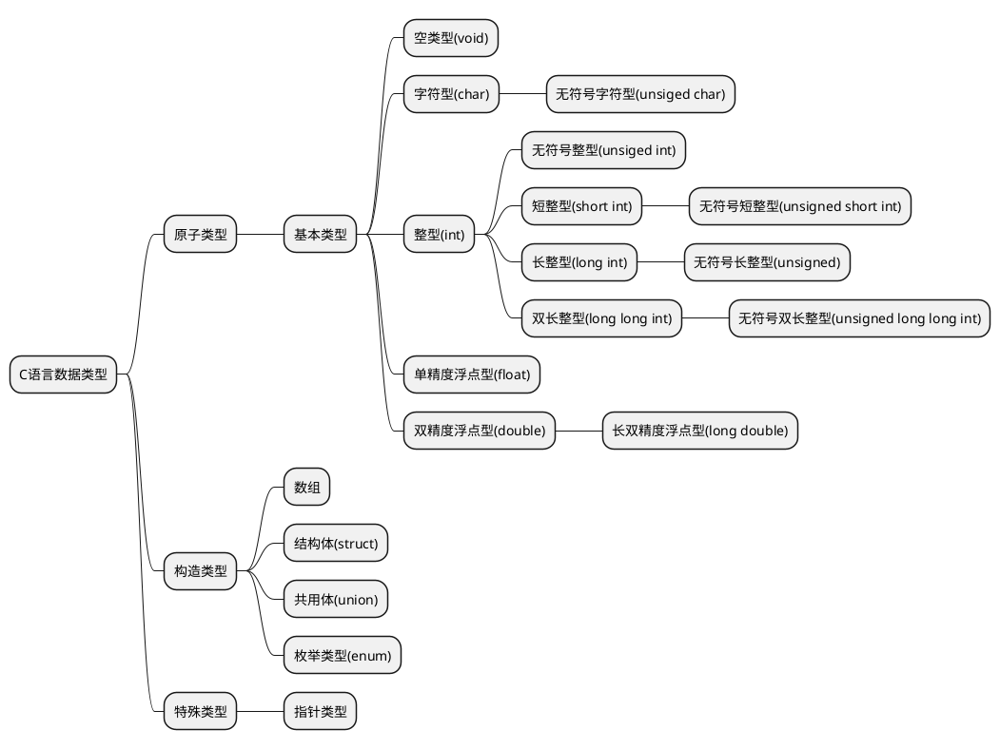

# C数据类型 

C语言的数据类型可以基本划分如下

## 原子类型
### 空类型(void)

>[!tip|label:说明]

常用于没有返回值的空函数。

空函数：返回值为void类型的函数，可以用return，也可以不用return。 不用return和在函数结束处有个return是等效的。但要注意return后面除了分号以外什么也没有。

>[!note|label:语法]

```
void 函数名(函数参数类型1 函数参数变量名1,函数参数类型1 函数参数变量名2,……,函数参数类型n 函数参数变量名n)
{
    函数内执行语句1;
    函数内执行语句2;
    ……;
    函数内执行语句n;
    return; //可以省略不写
}
```

>[!attention|label:示例]

```
void FunName(int IntName)
{
    return;
}    //该示例就定义了一个无返回值的函数，其中参数为一个整型
```

>[!warning|label:其他]

略

### 字符型(char)

>[!tip|label:说明]

字符型在其本质上就是整形，我们在C语言中使用char表示一个字符型，他占用一个字符的存储空间，字符型在存储时其内部存储的依旧是二进制数据，当我们读出时将会得到一个整形数据，而我们输出时会得到一个字符是因为我们人为的定义了一个对照表，这个表规定字符a的数值就是97，所以当我们遇到97时我们有两种读出方式，第一种以整数形式读出就是97，另一种就是以字符型读出，使用%c指定读出形式，则对照表则为a。

>[!note|label:语法]

```
char 变量名( = "初始字符");/*括号内内容即使改为一个不加引号的数字（在ASCII范围
内）也是成立的，同时转义字符也可以*/
```

>[!attention|label:示例]

```
char CharName0 = "0"; //将字符"0"初始化为CharName0的值，Ascii值为48
char CharName1 = 0;  //将值0初始化CharName1的值，与前面的语句含义不同
char CharName2 = "\0"; //将转义字符"\0"初始化为CharName2的值，与第二条语句含义相同
```
>[!warning|label:其他]

>[!tip|style:callout|label:格式说明符]

```
%c
```

>[!note|style:callout|label:所占字节]

char字符型在一般情况下仅占据一个字节。

>[!attention|style:callout|label:小技巧]

C语言中可以使用`sizeof()`函数获得char的字节数，下面的其他数据类型类似

#### 无符号字符型(unsigned char)

"unsigned char" 是一种数据类型，用于在编程中表示无符号的八位整数。它只能存储0到255之间的数字，并且通常用来处理颜色值、字符数据或者在内存有限的环境中存储小整数值。

其他各项与char字符型类似，因此不再赘述。

### 整型(int)

>[!tip|label:说明]

int整型用于表示整数

>[!note|label:语法]

```
int 变量名( = 初始值);
```
>[!attention|label:示例]

```
int IntName = 0; 
```

>[!warning|label:其他]

>[!tip|style:callout|label:格式说明符]

```
%d,%u,%o,%#o,%x,%#x
```

需要特别注意的是，其中出现的`#`符号表示带C语言前缀的输出。

>[!note|style:callout|label:所占字节]

int整型在一般情况下占据四个字节。

#### 无符号整型(unsigned int)

表示非负整数值，用法与int型类似

#### 短整型(short int)

>[!tip|label:说明]

short int短整型可以简写为short

>[!note|label:语法]

```
short (int) 变量名 (= 初始值);//（其中括号内的部分是可选的）
```

>[!attention|label:示例]

```
short ShortName = 0;
```
>[!warning|label:其他]

>[!tip|style:callout|label:格式说明符]

```
%hd,%hu,%ho,%#ho,%hx,%#hx
```
>[!note|style:callout|label:所占字节]

short int短整型占两个字节。

##### 无符号短整型(unsigned short int)

表示非负的短整型数据，用法与短整型类似。

#### 长整型(long int)

>[!tip|label:说明]

long int长整型可简写为long。

>[!note|label:语法]

```
long (int )变量名( = 初始值);
```
>[!attention|label:示例]

```
long LongName = 0;
```

>[!warning|label:其他]

>[!tip|style:callout|label:格式说明符]

```
%ld,%lu,%lo,%#lo,%lx,%#lx
```
>[!note|style:callout|label:所占字节]

long int长整型占四个字节

##### 无符号长整型(unsigned long int)

表示非负的长整型数据，用法与长整型类似。

#### 双长整型(long long int)

>[!tip|label:说明]

long long int双长整型可简写为long long.

>[!note|label:语法]
```
long long (int )变量名( = 初始值);
```

>[!attention|label:示例]

```
long long LLongName = 0;
```

>[!warning|label:其他]

>[!tip|style:callout|label:格式说明符]

```
%lld,%llu,%llo,%#llo,%llx,%#llx
```

>[!tip|style:callout|label:所占字节]

* （1）C语言标准是这样规定的：int最少16位（2字节），long不能比int短，short不能比int长，具体位长由编译器开发商根据各种情况自己决定。
* （2）32位平台下long 是4个字节，long long 是8字节；但是64位平台下则全是8字节。因 此为了保证平台的通用性，程序中尽量不要使用long数据类型。

##### 无符号双长整型(unsigned long long int)

表示非负的双长整型，与双长整型类似。

### 浮点型
#### 单精度型(float)
>[!tip|label:说明]

系统的基本浮点类型。至少能精确表示小数点后6位有效数字。

>[!note|label:语法]

```
float 变量名( = 初始值);//除了使用小数外，还可以使用科学计数法如1e2(表示100)
```
>[!attention|label:示例]

```
float FloatName = 0;
```
>[!warning|label:其他]

>[!tip|style:callout|label:格式说明符]

```
%f,%e,%a
```

需要注意的是，其中%e表示输出指数计数法下表示的数，而%a需要支持C99，且输出也为指数格式。

>[!note|style:callout|label:所占字节]

一个float类型占用4个字节的存储位。
其中最高位为符号位，紧接着8位为指数位，剩下的23位为尾数位。


#### 双精度型double

>[!tip|label:说明]

双精度浮点类型。至少能精确表示小数点后12位有效数字。

>[!note|label:语法]

```
double 变量名( = 初始值);
```
>[!attention|label:示例]

```
double DoubleName = 0;
```
>[!warning|label:其他]

>[!tip|style:callout|label:格式说明符]

```
%f,%e,%a
```
>[!note|style:callout|label:备注]

注意 float 和 double 类型的输出都使用%f、%e 或 %a说明符，
这是由于当它们向那些未在原型中显示说明参数类型的函数（如printf() ）传递参数时，
C自动将float类型的参数转换成double类型。

>[!attention|style:callout|label:所占字节]

一个double类型占用8个字节的存储位。
最高位为符号位，紧接着8位为指数位，剩下的52位为尾数位。

##### 长双整型(long double)

>[!tip|label:说明]

"long double"是C语言中的一个数据类型，表示双精度浮点型的扩展版本。它占用的内存比普通的"double"更大，提供了更高的精度和更宽的范围来存储数值，特别是小数部分。在不同的系统上，"long double"的具体大小和精度可能会有所不同，但通常至少与64位IEEE 754格式相匹配，可以提供10到13个有效数字。

>[!note|label:语法]

```
long double 变量名( = 初始值);
```

>[!attention|label:示例]

```
long double LongDoubleName = 0;
```

>[!warning|label:其他]

>[!tip|style:callout|label:格式说明符]

对于`long double`其输出格式为：
```
%lf,%le,%la
```

## 构造类型
### 数组
>[!tip|label:说明]

数组是按照顺序存储的一系列类型相同的值，如10个char类型的字符或15个int类型的值。整个数组有一个数组名，通过整数下标访问数组中单独的项或元素。

>[!note|label:语法]

```
基本变量类型 变量名[数组元素数]( = {元素初始值1,元素初始值2,……,元素初始值n,……})
//其中花括号内可以是仅有一个0，表示将数组所有元素都置0
```
>[!attention|label:示例]

```
int ArrayIntName[10] = {0};
/*一个包含10个元素的数组，每个元素都可以存储int类型的值
后面的等于0，初始化所有元素为0*/

float ArrayFloatName[20];
/*一个内容20个元素的数组，每个元素都可以存储float类型的值。*/
```

>[!warning|label:其他]

>[!tip|style:callout|label:备注]

注意，数组元素的编号从0开始，不是从1开始。

可以给每个元素赋数组类型对应的值。
例如，可以这样写：
```
debts[5] = 32.54;
debts[6] = 1.2e + 21;
```

实际上，使用数组元素和使用同类型的变量一样。
例如，可以这样把值读入指定的元素中：
~~~
scanf("%f",&debts[4]);
/*把一个值读入数组的第5个元素这里要注意一个潜在的陷阱：
考虑到影响执行的速度，C编译器不会检查数组的下标是否正确。*/
~~~

下面的代码，其实都不正确：
```
debts[20] = 88.32;
//该数组元素不存在！
debts[33] = 828.12;
//该数组元素不存在！
/*编译器不会查找这样的错误。
当运行程序时，这会导致数据被放置在已被其他数据占用的地方，
可能会破坏程序的结果甚至导致程序异常中断。*/
```

### 结构体
>[!tip|label:说明]

结构体是一种自定义的复合数据类型。

例如存储学生信息就会用到此种数据类型。

结构体关键字：struct

>[!note|label:语法]

定义
```
struct 结构体名
{
    成员变量类型1 成员变量名1;
    成员变量类型2 成员变量名2;
    ……
    成员变量类型n 成员变量名n;
};
```
声明：
```
struct 结构体名 结构体变量名( = {成员变量1初始化值，成员变量2初始化值,……,成员变量n初始化值})
```

>[!attention|label:示例]

定义：
```
//定义student这种结构体（注意分号不能少），有三个成员变量id，age，name。

struct student
{     
	long int id;     
	int age;     
	char name[8]; 
};
```

声明：
```
struct student stu1; //定义了一个student类型的变量stu1
```

初始化：
```
struct student stu1;
 stu1.id = 12345; /*通过成员运算符’.'来访问结构体的
成员变量*/
stu1.age = 20;
strcpy(stu1.age,“Liang”); /*因为数组在非初始化时，不能直接通过数组名直接赋值，
strcpy函数需要包含头文件string.h 错误的写法：stu1.name = “Liang”;*/
```

在声明结构体变量时同时初始化，类似于数组初始化。
```
#include <stdio.h>
#include <string.h> 

struct student
 { 
 	long int id; 
 	int age; 
 	char name[8];
 }; 
 
 int main(int argc,char* argv[])
 { 
 	struct student stu1 = {12345,22,"Liang"}; 
  	printf("id=%ld age=%d name=%s \n",stu1.id,stu1.age,stu1.name);
  	return 0;
 }

```
>[!warning|label:其他]

>[!tip|style:callout|label:小技巧]

可以使用结构体指针结合"->"来访问成员变量。
例如:
~~~
struct student *sp = &stu1;
sp->id = 12345;
~~~

可以使用typedef进行替代:
```
typedef struct student Student;
```

[!note|style:callout|label:关于结构体的更近一步讨论]

1)同类型的结构体之间可以直接赋值。例如：
```
#include <stdio.h>
#include <string.h> 

struct student
{ 
    long int id; 
    int age; 
    char name[8];
}; 
 
int main(int argc,char* argv[])
{ 
    struct student stu1 = {12345,22,"Liang"}; 
    struct student stu2;
    stu2 = stu1;
    return 0;
}

```
2）结构体嵌套
```
#include <stdio.h>
#include <string.h> 

struct student
{ 
   long int id; 
   int age; 
   struct day
   {
      int day;
      int month;
      int year; 
   }birthday;
   char name[8];
}; 
 ```
 3)匿名结构体 (应用场景：比如限定只有一个超级用户。)
 匿名结构体只能在定义结构体的同时声明变量，定义之后无法再声明变量。
 ```
#include <stdio.h>
#include <string.h> 

struct student
{ 
	long int id; 
	int age; 
	char name[8];
}stu1 = {12345,22,"Liang"};

int main(int argc,char* argv[])
{ 
  printf("id=%ld age=%d name=%s \n",stu1.id,stu1.age,stu1.name);
  return 0;
}
```

### 共用体
>[!tip|label:说明]

关键字：union

共用体也叫联合体，使几个不同类型的变量共占一段内存(相互覆盖)，也就是说共用体的成员共用一片内存，后赋值的成员变量的数据才是共用体的生效数据，因为前面的赋值已经被覆盖了。

共用体所占内存至少能够容纳最大的成员变量所需的空间。

应用场景，比如需要一种既可以存储int型数据也可以存储double型数据的变量。比如识别设备，如果是U盘我要这样读取，如果是手机我又要这样读取……

声明共用体变量 、初始化、赋值与结构体类似。(后赋值的成员变量会覆盖前面赋值的成员的数据)

>[!note|label:语法]

定义：
```
union 共用体名
{
    成员变量类型1 成员变量名1;
    成员变量类型2 成员变量名2;
    ……
    成员变量类型n 成员变量名n;
};
```

声明：
```
union 共用体名 共用体变量名;
```
>[!attention|label:示例]

定义：
```
union Test {
    int a;
    double pi;
    char str[20];
};
```

声明：
```
union Test a,b
```

>[!warning|label:其他]

>[!tip|style:callout|label:小技巧]

定义一个共用体变量，与结构体一样可以在定义的时候就直接声明，如声明共用体变量union_a,union_b
```
union Test {
    int a;
    double pi;
    char str[20];
}union_a,union_b;
```

### 枚举类型
>[!tip|label:说明]

关键字：enum

枚举是 C 语言中的一种基本数据类型，用于定义一组具有离散值的常量，它可以让数据更简洁，更易读。

枚举类型通常用于为程序中的一组相关的常量取名字，以便于程序的可读性和维护性。

定义一个枚举类型，需要使用 enum 关键字，后面跟着枚举类型的名称，以及用大括号 {} 括起来的一组枚举常量。每个枚举常量可以用一个标识符来表示，也可以为它们指定一个整数值，如果没有指定，那么默认从 0 开始递增。

>[!note|label:语法]
声明：
```
enum　枚举名　
{
    枚举元素1,
    枚举元素2,
    ……,
    枚举元素n
};
```
>[!attention|label:示例]
```
enum DAY
{
      MON=1, TUE, WED, THU, FRI, SAT, SUN
};
```
>[!warning|label:其他]

>[!tip|style:callout|label:小技巧]

第一个枚举成员的默认值为整型的 0，后续枚举成员的值在前一个成员上加 1。我们在这个实例中把第一个枚举成员的值定义为 1，第二个就为 2，以此类推。

可以在定义枚举类型时改变枚举元素的值：
```
enum season {spring, summer=3, autumn, winter};
```
没有指定值的枚举元素，其值为前一元素加 1。也就说 spring 的值为 0，summer 的值
为 3，autumn 的值为 4，winter 的值为 5

>[!note|style:callout|label:定义方式]

~~~
//可以通过以下三种方式来定义枚举变量

//先定义枚举类型，再定义枚举变量

enum DAY
{
      MON=1, TUE, WED, THU, FRI, SAT, SUN
};
enum DAY day;

//定义枚举类型的同时定义枚举变量

enum DAY
{
      MON=1, TUE, WED, THU, FRI, SAT, SUN
} day;

//省略枚举名称，直接定义枚举变量

enum
{
      MON=1, TUE, WED, THU, FRI, SAT, SUN
} day;
~~~

>[!attention|style:callout|label:枚举]

在C 语言中，枚举类型是被当做 int 或者 unsigned int 类型来处理的，所以按照 C 语言规范是没有办法遍历枚举类型的。

不过在一些特殊的情况下，枚举类型必须连续是可以实现有条件的遍历。
~~~
#include <stdio.h>
 
enum DAY
{
      MON=1, TUE, WED, THU, FRI, SAT, SUN
} day;
int main()
{
    // 遍历枚举元素
    for (day = MON; day <= SUN; day++) {
        printf("枚举元素：%d \n", day);
    }
}
~~~

以下枚举类型不连续，这种枚举无法遍历。
~~~
enum
{
    ENUM_0,
    ENUM_10 = 10,
    ENUM_11
};
~~~

枚举在 switch 中的使用：
~~~
#include <stdio.h>
#include <stdlib.h>
int main()
{
 
    enum color { red=1, green, blue };
 
    enum  color favorite_color;
 
    /* 用户输入数字来选择颜色 */
    printf("请输入你喜欢的颜色: (1. red, 2. green, 3. blue): ");
    scanf("%u", &favorite_color);
 
    /* 输出结果 */
    switch (favorite_color)
    {
    case red:
        printf("你喜欢的颜色是红色");
        break;
    case green:
        printf("你喜欢的颜色是绿色");
        break;
    case blue:
        printf("你喜欢的颜色是蓝色");
        break;
    default:
        printf("你没有选择你喜欢的颜色");
    }
 
    return 0;
}
~~~

将整数转换为枚举
~~~
#include <stdio.h>
#include <stdlib.h>
 
int main()
{
 
    enum day
    {
        saturday,
        sunday,
        monday,
        tuesday,
        wednesday,
        thursday,
        friday
    } workday;
 
    int a = 1;
    enum day weekend;
    weekend = ( enum day ) a;  //类型转换
    //weekend = a; //错误
    printf("weekend:%d",weekend);
    return 0;
}
~~~

## 特殊类型
### 指针类型

从根本上看，指针是一个值为内存地址的变量(或数据对象)。
正如char类型变量的值是字符，int类型的变量的值是整数，指针变量的值是地址。

* 指针的声明：
~~~
int *p; 
// 声明一个 int 类型的指针 p
char *p;
 // 声明一个 char 类型的指针 p
int *arr[10];
 // 声明一个指针数组，该数组有10个元素，其中每个元素都是一个指向 int 类型对象的指针
int (*arr)[10];
 // 声明一个数组指针，该指针指向一个 int 类型的一维数组
int **p; 
// 声明一个指针 p ，该指针指向一个 int 类型的指针
~~~
>[!note|label:注]

> 所有类型的指针大小都是4个字节(当然这取决与你是多少位的电脑，比如我测试用的是32
> 位，指针理所当然就是4字节)。可以通过下面的代码自行验证：
> ~~~
> #include <stdio.h>
> #include <stdlib.h>
> #include <string.h>
> #include <unistd.h>
>
> typedef struct book
> {
>     char book_name[20];
>     int book_value;
> }BOOK;
> 
> 
> int main()
> {
>     BOOK *book_one;
>     //printf("book_one prt address:%p",book_one);
>     book_one->book_value = 10;
>
>     int *a;
>     char *b;
>     short *c;
>     long *d;
>     long long *e;
>     int *arr_save_ten_ptr[10];
>     int (*ptr_to_arr)[10];
>     int **p;
>
>     //printf("book_one prt address:%p\n",book_one);
>     printf("size of BOOK struct:%d\n",sizeof(book_one));
>     printf("size of a:%d\n",sizeof(a));
>     printf("size of b:%d\n",sizeof(b));
>     printf("size of c:%d\n",sizeof(c));
>     printf("size of d:%d\n",sizeof(d));
>     printf("size of e:%d\n",sizeof(e));
>     printf("size of arr_save_ten_ptr:%d\n",sizeof(arr_save_ten_ptr));
>     printf("size of ptr_to_arr:%d\n",sizeof(ptr_to_arr));
>     printf("size of p:%d\n",sizeof(p));
> 
>     return 0;
> }
> ~~~

* 指针的初始化:
```
/* 方法1：使指针指向现有的内存 */
int x = 1;
int *p = &x; 
// 指针 p 被初始化，指向变量 x ，其中取地址符 & 用于产生操作数内存地址
/* 方法2：动态分配内存给指针 */
int *p;
p = (int *)malloc(sizeof(int) * 10);
 // malloc 函数用于动态分配内存，此处分配了40个字节
free§;　　　　
/* free 函数用于释放一块已经分配的内存，
常与 malloc 函数一起使用，
要使用这两个函数需要头文件 stdlib.h*/
```

* 未初始化和非法的指针
如果一个指针没有被初始化，那么程序就不知道它指向哪里。它可能指向一个非法地址，这时，程序会报错，在 Linux 上，错误类型是 Segmentation fault（core dumped），提醒我们段违例或内存错误。它也可能指向一个合法地址，实际上，这种情况更严重，你的程序或许能正常运行，但是这个没有被初始化的指针所指向的那个位置的值将会被修改，而你并无意去修改它。

* NULL指针
NULL 指针是一个特殊的指针变量，表示不指向任何东西。可以通过给一个指针赋一个零值来生成一个 NULL 指针。

* 指针的运算
C 指针的算术运算只限于两种形式：
  * 1） 指针 +/- 整数 ：
　　 可以对指针变量 p 进行 p++、p–、p + i 等操作，所得结果也是一个指针，只是指针所指向的内存地址相比于 p 所指的内存地址前进或者后退了 i 个操作数。要注意的是，这种运算并不会改变指针变量 p 自身的地址，只是改变了它所指向的地址。

  * 2）指针 - 指针
　　只有当两个指针都指向同一个数组中的元素时，才允许从一个指针减去另一个指针。两个指针相减的结果的类型是 ptrdiff_t，它是一种有符号整数类型。减法运算的值是两个指针在内存中的距离（以数组元素的长度为单位，而不是以字节为单位），因为减法运算的结果将除以数组元素类型的长度。举个例子：

~~~
#include “stdio.h”

int main()
{
int a[10] = {1,2,3,4,5,6,7,8,9,0};
int sub;
int *p1 = &a[2];
int *p2 = &a[8];

sub = p2-p1;
printf("%d\n",sub);　　　　// 输出结果为 6

return 0;
}
~~~

